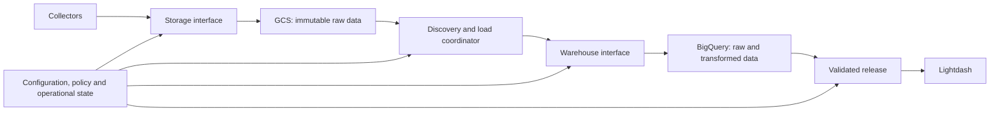

# GCS and BigQuery migration plan

Drafted: 2026-09-17. Revised: 2026-09-22 for the near-free operating target.

Status: saved for later implementation. This document does not provision resources, change runtime configuration, or authorize spending by itself. Prices and integration capabilities must be revalidated when implementation begins.

The migration is a portability refactor followed by a staged cutover, with GCS and BigQuery as the first cloud implementations. **The operating target is near-free**: warehouse queries stay inside BigQuery's free 1 TiB/month, and the only material charges are storage. The **$100/month** storage-and-warehouse budget remains the hard ceiling and the **$50 migration allowance** is unchanged. These are policies, not a guaranteed billing ceiling.

### Near-free path (2026-09-22 revision)

Measured on 2026-09-22 against the local warehouse, raw archive and load ledger, and priced at on-demand $6.25/TiB (first 1 TiB/month free), logical storage $0.02/GiB-month (first 10 GiB free) and GCS Standard $0.020/GiB-month in `us-central1`:

| Decision | Effect |
|---|---|
| `sensor_community` and `openactive_feeds` are **retired**, not migrated (`extract/retired_sources.yml`) | Removes ~61% of warehouse storage, ~80% of its growth and ~39% of projected cost. Their collected data stays local. |
| Every family builds **once daily** in the cloud profile | Transformations scan ~21 GiB/day (~0.6 TiB/month), inside the free tier. Twice-hourly builds would scan ~220 GiB/day (~$34/month). |
| Loader novelty probes run on local artifacts, never as warehouse queries | Avoids ~50 GiB/day (~1.5 TiB/month) of 10 MB minimum-billed probe queries. |
| Raw archive in GCS as gzipped NDJSON (measured 16.8× compression) | ~5 GiB for the kept history plus ~4 GiB/month; under $1/month storage, ~$1.50/month object writes. |
| Warehouse storage (kept sources) | ~295 GiB logical, growing ~5.9 GiB/day: ~$9/month in month 1, ~$16 in month 3, ~$49 in month 12 before long-term pricing. Dropping `_payload` from warehouse raw (Step 4) roughly halves raw storage. |

Queries are free only if the pipeline, Lightdash and development together stay under 1 TiB/month; Step 6 allocates it. Storage is the cost that grows, and is reviewed monthly (Step 7).

The portability promise is: **switching between implemented, tested backends requires configuration and a managed data cutover—not edits across collectors, models, DAGs, and dashboards.** Adding an entirely new warehouse still requires one adapter package and its conformance tests.

Scope: storage, loading, transformations, analytics serving, and their operational metadata. Hosting Airflow, collectors, bots, and Lightdash remains a separate decision. Their compute and model API costs are outside the budgets above.

**1. Establish the target architecture and configuration contract.**



Use these initial infrastructure choices:

| Area | Decision |
|---|---|
| Location | `us-central1` for GCS, BigQuery datasets, and staging |
| Object storage | Regional GCS Standard |
| Warehouse | BigQuery native tables, on-demand compute, sized for the 1 TiB/month free tier |
| Loading | Batched loads; no streaming ingestion initially |
| Transformations | Existing dbt project, with adapter-dispatched SQL; each family built once daily |
| Analytics | Lightdash queries validated BigQuery marts directly |
| Sources | Everything configured except retired sources (`extract/retired_sources.yml`) |
| Raw archive | Gzipped NDJSON in Hive-style partitions, queryable ad hoc through BigQuery external tables |
| Operational state | Dedicated PostgreSQL database, separate from application-owned tables |
| Infrastructure provisioning | Versioned Terraform modules |
| Authentication | Attached workload identity or federation; no credentials in repository configuration |

Create separate query-billing projects for **production pipelines, BI, development, and migration**. Production datasets and buckets belong to the production project. This separates query allowances without duplicating data.

One validated configuration file selects named storage, warehouse, serving, and policy profiles. Generate existing environment settings and dbt profiles from it, respecting the deployment configuration rendering workflow.

Illustrative configuration, to be implemented rather than copied into existing runtime configuration:

```yaml
environment: production

storage_profile: gcs_primary
warehouse_profile: bigquery_primary
serving_profile: warehouse_direct
cost_policy: conservative

logical_namespaces:
  raw: raw
  metadata: load_meta
  staging: staging
  marts: marts

execution:
  load_workers: 4
  transform_threads: 2
  concurrent_transform_builds: 1
```

Provider-specific identifiers, credential references, regions, and tuning live inside the selected profiles. Source definitions and business models refer only to logical names.

Validate configuration before deployment. Unsupported capabilities, incompatible locations, or missing cost controls must fail explicitly.

**2. Replace the existing partial abstractions with enforceable interfaces.**

The repository has useful starting points, but [storage](orchestration/include/sinks.py), [discovery](load/loader/discovery.py), [destination loading](load/loader/destinations/base.py), and [publishing](visualization/project.py) contain assumptions that prevent a configuration-only switch.

Implement these boundaries:

| Interface | Responsibilities |
|---|---|
| `ArtifactStore` | Immutable writes, reads, checksums, manifests, listing, conditional publication, holds |
| `OperationalStore` | Queue claims, leases, retries, discovery cursors, budget reservations |
| `WarehouseAdapter` | Schema inspection, batch loading, transactional publication, ledger, bounded queries, export |
| dbt adapter macros | SQL dialect, types, JSON operations, timestamps, hashes, incremental strategies |
| `ServingAdapter` | Validated release creation, activation, rollback, connection and manifest generation |
| `CostPolicy` | Estimates, admission limits, concurrency, accounting, pause reasons |

Keep provider SDK imports inside adapter implementations. Shared code must not branch on `gcs`, `bigquery`, or `duckdb`.

Deliver local, GCS, and S3-compatible storage adapters; DuckDB and BigQuery warehouse adapters. Snowflake becomes a later adapter implementation without changes to shared orchestration or model business logic.

Support storage and warehouse selection independently. When a warehouse requires native staging, its adapter copies from the configured artifact store into temporary native staging. Cross-cloud transfers require an explicit policy setting and estimated transfer costs.

Update warehouse inspection and generated-source tooling, including `transform/scripts/sync_raw_sources.py`, to use these boundaries. Provider-specific behavior must not remain hidden in monitoring, cadence probes, CLI commands, or serving metadata generation.

**3. Make raw artifacts portable and reliably replayable.**

Use gzipped NDJSON as the authoritative raw archive: one gzip object per extraction artifact, compressed before upload. Preserve original record bytes; create Parquet only as a derived loading format.

Keep the local Hive-style layout so the archive stays queryable, and keep manifests out of the data prefix:

```text
gs://<raw-bucket>/raw/source=<name>/dt=YYYY-MM-DD/<artifact>.ndjson.gz        data only
gs://<raw-bucket>/manifests/source=<name>/dt=YYYY-MM-DD/<artifact>.meta.json  commit markers
```

Today's local tree interleaves `*.ndjson.meta.json` files with the data; an external table over that prefix would read them as records. Gzip also bounds each object: BigQuery accepts compressed NDJSON up to 4 GB per file, and the largest current artifact is 3.7 GiB *uncompressed*.

Retired sources (`extract/retired_sources.yml`) are not uploaded or loaded; their local raw files stay where they are until a human decides otherwise.

Each committed artifact has a versioned manifest containing:

- Stable artifact ID, source, extraction run, and schema version.
- Logical partition and original provenance.
- Object location, checksum, byte count, and record count.
- Completeness, health, hold status, and extraction evidence.
- Encoding and compression.

Publish immutable data first, then publish the manifest as the commit marker. Discovery must never infer success from an object merely existing. Object storage publication must not depend on filesystem rename semantics.

Use incremental discovery with durable cursors and a daily reconciliation pass. Notifications may accelerate discovery later, but cannot become the sole correctness mechanism.

**Preserve existing identities during migration.** The current loader derives `_row_id` from the local path and row number. Maintain an alias mapping from legacy paths to portable artifact IDs, preserving historical `_row_id`, `_source_file`, content hashes, and downstream keys. Changing storage location must not create a new logical record.

For new artifacts, derive identity from immutable logical metadata, independent of bucket, provider, and local mount point. Version the identity algorithm.

Holds and releases remain audited operations. Corrupt or unreadable hold metadata must stop loading that artifact until reconciled. Preserve legitimate records repeated across separate extraction runs: idempotency applies to replaying the same artifact, not cross-run deduplication of RAW.

**Ad hoc inspection of raw data (federated queries).** Gzip does not prevent it. A BigQuery external table can read gzip-compressed NDJSON in GCS directly, and the `source=`/`dt=` directories become queryable partition columns:

```sql
CREATE EXTERNAL TABLE raw_archive.gbfs_citibike
WITH PARTITION COLUMNS (dt DATE)
OPTIONS (
  format = 'NEWLINE_DELIMITED_JSON',
  compression = 'GZIP',
  uris = ['gs://<raw-bucket>/raw/source=gbfs_citibike/*'],
  hive_partition_uri_prefix = 'gs://<raw-bucket>/raw/source=gbfs_citibike',
  require_hive_partition_filter = true
);

SELECT * FROM raw_archive.gbfs_citibike WHERE dt = '2026-09-21' LIMIT 100;
```

The costs to plan for:

- **Plan on paying for every uncompressed byte of every file in the partitions a query touches.** On-demand external queries are billed for bytes read; row formats have no column pruning, and compression reduces storage, not the bytes BigQuery processes. `require_hive_partition_filter` makes an unfiltered query fail rather than read the whole source. One day of `gbfs_citibike` is ~0.26 GiB, so occasional inspection fits the free tier easily; a query over all history for a large source does not. Verify with a dry run before large queries.
- **Gzip files cannot be read in parallel**, so each file is decompressed by one worker. That is slower, not more expensive, and irrelevant at inspection scale.
- **Records whose shape varies** across artifacts (such as JSON payloads) are easier to inspect schema-free: define the external table as CSV with a delimiter and quote character that never occur, read each line as one `STRING` column, and use `JSON_VALUE`/`JSON_QUERY`.
- Create inspection tables in a separate `raw_archive` dataset billed to the development project, so they draw on the development query allowance.

**4. Implement BigQuery loading without weakening retry guarantees.**

Retain the existing guarantee that raw records and their successful-load ledger entry become visible together.

The BigQuery path will:

1. Claim a bounded batch of committed, unheld artifacts.
2. Convert records into typed Parquet with existing provenance and row identities.
3. Batch-load that data into an expiring staging table using a deterministic job ID.
4. Validate staging counts and schema.
5. In a transaction, check the durable artifact ledger, insert previously unpublished records, and record publication.
6. Acknowledge the queue only after confirmed commit.

Use a transactional guard row to serialize final publication and prevent concurrent duplicate commits. Parallelize preparation and staging initially; keep final commits serialized until measurements justify more complexity. BigQuery primary-key declarations are not a substitute for deduplication.

On a timeout, inspect the existing job before retrying. A lost response must not trigger an unchecked second append.

Batch loads using the shared slot pool have no loading compute charge; subsequent SQL publication and transformation still consume query budget. BigQuery supports atomic multi-table DML transactions. [Batch loading](https://docs.cloud.google.com/bigquery/docs/batch-loading-data), [transactions](https://docs.cloud.google.com/bigquery/docs/transactions).

Additional decisions:

- Preserve `_payload` initially because existing models and recovery depend on it. Because the GCS archive keeps the original bytes and is queryable (Step 3), evaluate during the pilot dropping `_payload` from warehouse raw once models no longer read it; it is roughly half of raw storage.
- Compute loader cadence/novelty observations from the local artifacts before upload, never with warehouse queries. Each warehouse probe is billed at least 10 MB, and the current ~5,400 batches/day would cost ~1.5 TiB/month.
- Keep additive schema evolution.
- Surface incompatible type changes and casting losses explicitly.
- Quarantine malformed batches according to the existing source policy.
- Query ledger metadata incrementally, rather than rereading its full history on every poll.
- Preserve completeness, validation, and hold gates throughout.

**5. Port transformations while preserving results and controlling scans.**

Keep one set of business models. Move warehouse differences into `transform/macros/` and adapter-specific materializations.

Cover JSON extraction, safe casts, timestamp handling, arrays and structs, quoting, hashing, and incremental publication. Preserve hash serialization exactly where existing keys depend on it; test golden input/output examples on both warehouses.

Partition large raw tables by ingestion date, while retaining source/event dates separately. Track exactly which raw batches and event partitions changed.

For marts:

- Partition large time-series models by the relevant business date.
- Cluster around frequently filtered entity keys.
- Bound both source reads and destination updates.
- Process late arrivals by their affected partitions, including old partitions.
- Rebuild small dimensions only when their inputs change.
- Require partition filters for large tables exposed to routine querying.
- Serve common long-range dashboards from aggregate marts.

Replace maximum-timestamp-only progress tracking with durable batch checkpoints. A failed build does not advance its checkpoint.

Build every family **once daily** in the cloud production profile, after the daily extractions, and skip builds with unchanged upstream inputs. That keeps transformations at ~21 GiB/day, inside the free tier; a faster cadence for any family is a cost proposal under Step 10. Scope `unique`/`not_null` tests on large incremental marts to newly loaded partitions (dbt `where` config); full-column tests on every run are the largest scan in today's DuckDB workload. Start with two dbt threads and one transform build at a time. Routine production jobs cannot invoke an unrestricted full refresh.

Pin and test the dbt adapter against the repository's current dbt Core version; upgrading dbt itself is a separate change. Update project guidance that currently requires DuckDB-only SQL when the portability implementation lands.

**6. Apply conservative, measurable cost controls.**

Split the free 1 TiB/month (~34 GiB/day, shared by every project on the billing account) between workloads:

| Workload | Daily query allowance | Per-query maximum | Initial concurrency |
|---|---:|---:|---:|
| Production pipeline, including validation | 24 GiB | 8 GiB | 2 query jobs |
| Lightdash and interactive analytics | 8 GiB | 2 GiB | 2 queries |
| Development, integration tests and raw-archive inspection | 2 GiB | 2 GiB | 1 query |
| Temporary migration/backfill | 1 TiB | 64 GiB | 1 query |

The migration allowance also has a **5 TiB cumulative application limit**, after which it pauses. Production jobs cannot use migration credentials or borrow its allowance.

The steady-state allowances total ~1.0 TiB/month, so a month within them costs nothing for queries. The daily production build was estimated at ~21 GiB/day. Two known pressure points must be fixed before cutover, not by raising limits:

- `fct_digitraffic_rail_train_observation` rebuilds from its whole raw table (7.4 GiB at measurement, growing) and will exceed the 8 GiB per-query cap; make it incremental. The other hourly/twice-hourly `table` marts that rebuild from full raw history (`sncf_station_equipment`, `hk_parking_vacancy`, `crossref_new_dois`, `melbourne_pedestrians`, `niord_warnings`, `catalonia_beaches`, `hk_library_computers`) should follow as they grow.
- Dashboards over the largest remaining marts (`malaysia_pricecatcher`, `globe_measurements`, `gbfs`) scan several GiB per chart over full history. Serve them from aggregate marts or date-bounded filters so one refresh fits the Lightdash allowance.

Five TiB of migration processing costs about **$31** (the free tier covers the first TiB of that month). These figures exclude storage, requests, transfers, and hosting. Revalidate pricing before implementation. [BigQuery pricing](https://cloud.google.com/bigquery/pricing).

Enforce limits through several layers:

- Native project-level daily query quotas.
- `maximumBytesBilled` on application, dbt, and Lightdash query submissions.
- Conservative estimates and application-side budget reservations before concurrent jobs start.
- Timeouts, bounded retries, and concurrency limits.
- Actual-job reconciliation, including failed jobs and script child jobs without double-counting.
- Billing alerts at 50%, 75%, 90%, and 100% of the $100 operating budget.

**Billing alerts are notifications. Native daily quotas are approximate, and neither is an exact dollar ceiling.** Per-query limits and controlled submission paths provide additional protection. Verify each limit through real rejection tests before enabling production traffic. [Budget behavior](https://docs.cloud.google.com/billing/docs/how-to/budgets), [query quotas](https://docs.cloud.google.com/bigquery/docs/custom-quotas), [query cost controls](https://docs.cloud.google.com/bigquery/docs/best-practices-costs).

When constrained, jobs enter a visible `paused_cost_limit` state with the estimate, limit, and resume condition. They retain their inputs and checkpoints. They must not repeatedly retry the same rejected query or silently raise limits.

Start without reservations, BI Engine, paid streaming, or automatic capacity purchases.

**7. Bound storage growth without deleting collected history.**

| Data | Initial retention policy |
|---|---|
| Authoritative raw archive and manifests | Retain; no automatic expiration |
| Held evidence | Retain until explicitly released under existing policy |
| Temporary load files and staging tables | Expire after 48 hours; regenerate from raw when necessary |
| Development tables | Expire after 7 days |
| Production raw tables and marts | Retain initially |
| Serving releases | Current release plus rollback releases for 7 days |
| Operational logs | 30 days searchable; durable decision/load evidence retained separately |

Use seven-day soft delete for authoritative GCS storage and disable redundant object versioning on immutable archives. Temporary storage does not need soft-delete retention. Soft-deleted objects still incur storage charges. [GCS soft delete](https://docs.cloud.google.com/storage/docs/soft-delete).

Start BigQuery with logical storage billing and seven-day time travel. Compare logical versus physical billing after 30 days using measured compression and rewrite history.

Monitor retained bytes and projected monthly storage cost daily. At 80% of the storage allocation, pause optional historical backfills and new-source activation; propose a retention or budget change. Do not delete historical data automatically to meet a target.

Storage is the near-free path's growing cost. The storage free tier (10 GiB) is far below the kept data, so expect, before long-term pricing: ~$9/month in month 1, ~$16 in month 3 and ~$49 in month 12 at the measured ~5.9 GiB/day. Partitions untouched for 90 days halve in price. Review the trend monthly; the first levers are dropping `_payload` from warehouse raw (~46% of raw) and physical billing, not deleting history. Every new source's projected storage growth is part of its activation proposal.

**8. Preserve validated serving and straightforward rollback.**

Publish validated BigQuery releases through a `ServingAdapter`. The local DuckDB → PostgreSQL publication was paused on 2026-09-22 (`LIGHTDASH_ENABLED=0`) and the PostgreSQL serving copy, which only duplicated DuckDB, was emptied to reclaim disk; the local Lightdash has no mart data until the cloud release is activated.

Build and test candidate marts, then create immutable serving snapshots and a release manifest. Activate the release only when all required checks pass. BigQuery snapshots are provider-specific implementation details behind the serving interface. Their retained changes must be included in storage accounting. [Snapshot storage](https://docs.cloud.google.com/bigquery/docs/storage_overview).

Use a short serving maintenance gate while changing the Lightdash release bundle and connection metadata. Already-running queries remain pinned to the previous release. Clear or version caches during activation.

Lightdash receives read access only to released marts. Its small application PostgreSQL database remains.

Keep the DuckDB/PostgreSQL serving adapter working so rollback remains a profile change, but a rollback now also means republishing every mart from DuckDB into the empty serving copy; measure that time during the recovery drill.

**9. Execute the migration in gated stages.**

| Stage | Work | Exit condition |
|---|---|---|
| Inventory | Capture artifacts, holds, loaded identities, schemas, models, dashboards, and freshness requirements | Every production dependency has an owner, mapping, and validation method |
| Portability refactor | Implement interfaces and central configuration while staying on local storage/DuckDB | Existing behavior passes regression tests |
| Cloud foundation | Provision projects, buckets, datasets, identities, quotas, and accounting | Access isolation and cost-limit rejection tests pass |
| Pilot | Migrate `amsat_status` (small, twice hourly), `gbfs` (largest remaining incremental family) and `malaysia_pricecatcher` (largest remaining by storage, daily) | Identity, schema, retry, late-arrival, and cost tests pass |
| Historical migration | Copy the raw archive as gzip; export loaded DuckDB data and ledgers at a recorded checkpoint; exclude retired sources | Artifact checksums and partition-level reconciliation pass |
| Shadow operation | Feed both destinations from the same committed artifacts | Seven consecutive healthy days, including daily jobs |
| Cutover | Drain pending publication, reconcile the final checkpoint, activate cloud profiles and serving release | Freshness and dashboard checks pass |
| Stabilization | Keep rollback data for 14 days; monitor costs and correctness | Recovery drill passes; cloud operation stays within policy |
| Cleanup | Retire redundant local warehouse, serving copy, and recovery exports. Retired sources' collected data is kept unless a human decides otherwise | Verified backups and explicit cleanup checklist completed |

Historical data should migrate from a consistent DuckDB export with its existing ledger, preserving original load timestamps and IDs. Raw files migrate separately as the replay archive. Reconcile any already-loaded historical data whose original raw artifact is missing; do not silently omit it.

Pause the writer only long enough to establish a consistent checkpoint/export. Collectors can continue producing queued artifacts.

Rollback triggers include unexplained reconciliation differences, sustained freshness failures, cost-control bypass, or broken serving. Revert the serving profile, catch DuckDB up from the durable artifact stream, and reconcile checkpoints before resuming its transforms.

**10. Define acceptance and expansion criteria now.**

Migration acceptance requires:

- Matching artifact checksums, row counts, identities, and load status.
- Exact integer/decimal comparisons; documented tolerances for floating-point results.
- Preserved uniqueness, referential relationships, completeness, and holds.
- Successful recovery from interrupted upload, lost load response, duplicate delivery, transaction conflict, and exhausted quota.
- Late-arriving and historical corrections applied without duplicate records.
- Dashboard query and permission checks on the released warehouse.
- Tested rollback with measured recovery time.
- Configuration-only switching across local/GCS storage and DuckDB/BigQuery, plus S3 storage contract tests.
- No production provider imports or SQL dialect branches outside the adapter boundaries.

Raise a limit only after telemetry shows necessary work cannot meet its freshness target **and** partitioning, repeated scans, retries, and scheduling have been checked. Each proposal records the observed bottleneck, projected monthly cost, proposed change, and rollback value.

Increase one constraint at a time, normally by **25%**, observe for seven days, and retain the previous setting for rollback. Bots may prepare those proposals; they cannot grant themselves additional spending authority.

The deliverable is complete when the cloud profiles run successfully, the local profiles remain usable, and a backend change is exercised through configuration and migration tooling rather than edits throughout the project.
