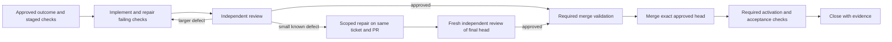

# Bot workflow overhaul: finish admitted work

Implementation record, 2026-09-21. The provider, worker, prompts, and tests described
below were implemented after this diagnosis. Runtime activation status is recorded in
the deployment notes at the end of this document.

The requested supervision loop has been stopped: its state has `enabled=false`
and `vintage-bot-supervision.timer` is disabled and inactive. Autopilot and
already-admitted bot work were not stopped. The old concurrency experiment has
not been declared complete; its supervising timer is off.

## Diagnosis

The system has many ways to propose, diagnose, defer, and block work, but too few
ways to finish a known repair. Increasing executor concurrency cannot fix that.
The desired operating rule should be: **finish the existing ticket, make the
small justified repair, obtain independent review, and merge as soon as its
actual merge requirements pass.**

Read-only database audit at **2026-09-21 15:18:06 UTC**, covering the preceding
24 hours, found:

| Observation | Consequence |
| --- | --- |
| 3,162 executive `model_rate_limited` reports, 198 `executive_decision_recorded`, two other decision failures | About 94% of executive run reports in this window were capacity failures. Prompt wording cannot restore provider capacity. Counts are run reports, not unique tickets or billing requests. |
| 64 applied `wait` decisions; GitHub waited five times, several other tickets four | Re-reading unchanged blockers spends decision capacity without providing a resolution path. |
| 29 applied configurations, 24 starts, eight assignments, seven acceptances | Routine lifecycle steps each consume separate executive turns. Some are necessary; many could be a guarded continuation of one approved plan. |
| Latest executions for open tickets with PRs: eight `unable_to_review`, four `changes_requested`, five approved, five pending | Review transport/format failures and substantive code findings need different recovery paths. Approval alone does not prove all merge gates pass. |
| 30 open tickets: five ready, 14 blocked, seven in review, four in progress | Worker availability is not the only constraint. |
| 15 applied completion decisions | The system does finish work when capacity and downstream requirements permit it; the problem is not a universal refusal to act. |

These are a snapshot, not benchmark results or evidence that the proposed design
will hit its targets. Live work continued during this audit.

Concrete cases from the supervision evidence:

* Open311 PR #114: independent review correctly caught `on_schema_change='fail'`
  on an existing incremental table after adding `media_url`. Its four presence
  checks passed but did not test the migration. The review is useful; sending the
  known correction through another general planning cycle is unnecessary.
* Sumo: offline parse and analysis passed; compile required an absent
  `/output/raw.duckdb`, and global content checking failed on Library of Congress
  metadata outside Sumo's scope. Repeating Sumo cannot repair either prerequisite.
* WHO policy, GeoJSON, job boards, and other PRs accumulated `unable_to_review`
  reports, including `review_json_invalid`. A valid new review is required, but
  a malformed response is not a code rejection that needs a new implementation.
* GitHub, arXiv, Open Library and PBDB have live-validation requirements. Current
  agents can repeatedly describe these requirements but cannot fulfill them.
* Source scheduling and analytics follow-ups produced two additional tickets
  while the existing backlog remained open. New follow-ups may be justified;
  ticket creation is not itself resolution.

## What the prompt audit found

All ten `bots/*/prompt.md` files were read, along with the executive prompt,
shared execution instructions, generated specialist context, appended report
schemas, follow-up instructions, and the actual sandbox worker prompt. The
installed `/opt/vintage-bot-runtime-v6/worker.py` still contains the read-only
reviewer instruction.

The executor and reviewer Markdown files are only three lines each. Live
admitted runs route through `provider_dashboard.run_admitted` to the sandbox;
their operative model prompt is **`bots/sandbox/worker.py:model_prompt`**, deployed
in the versioned root-owned runtime. Editing only their Markdown files will not
change live execution behavior.

| Prompt / instruction source | Current impediment | Proposed change |
| --- | --- | --- |
| `bots/executive_runner.py:PROMPT` | One action per turn; progress advice is weaker than the many reasons to wait. No review-retry, repair, or validation action. Merge wording conflates merge readiness with full ticket completion. | Prioritize finishing, use an explicit repair/validation route, distinguish stage requirements, and continue routine approved transitions through guarded service actions. |
| `bots/sandbox/worker.py:model_prompt` — executor; `task_executor/prompt.md` | Implement once, summarize, then worker runs checks. Failed final checks can end the attempt without a repair turn. | Own the implementation/check/repair cycle within the same admission and budget. Preserve the original check results and rerun repaired checks. |
| Same runtime — reviewer; `pr_reviewer/prompt.md` | Explicitly read-only; insufficient evidence broadly maps to `unable_to_review`; comments have no repair classification. | Review for material defects, label blocking versus optional findings, and route small known fixes into a scoped repair admission. Reviewer who edits becomes an author and cannot approve that resulting head. |
| `manager/prompt.md` | Produces up to seven strategic approval items; cannot directly resolve bot workflow failures. All-required-specialist freshness rule can make the whole report degraded. | Manage aging work, recurring blockers and completion capacity; report degraded evidence per affected conclusion. Keep uncertainty visible while acting on fresh evidence for unrelated work. |
| `failure_triage/prompt.md` | Diagnoses only non-bot failures; cannot retry or repair. | Keep source triage focused, but supply an exact repair handoff on the existing ticket. Add a separate deterministic recovery controller for bot failures. |
| `source_discovery/prompt.md` | Already bounded to two proposals and backpressure. | Retain the limit; rank by an executable end-to-end path, and defer ideas whose required validation has no owner/capability. |
| `source_vetting/prompt.md` | A positive recommendation creates implementation work without a typed capability-complete acceptance contract. | Produce an admission-ready implementation and validation plan; reuse existing work and identify prerequisites before acceptance. |
| `source_scheduling/prompt.md` | Every successful selected-item result is shaped as another task proposal, even on a follow-up. | Allow `already_satisfied`, `attach_evidence`, `revise_existing`, `request_validation`, or a genuinely distinct proposal. Do not confuse a live smoke requirement with scheduling work. |
| `cadence_review/prompt.md` | Adjustments become more proposed work. | Use bounded existing-ticket repair handoffs for justified changes; retain observe/keep for weak evidence. No new ticket for reworded evidence. |
| `analytics_engineer/prompt.md` | Requires global policy/viz checks and operator preview, but cannot supply the operator. | Separate owned checks, shared prerequisites, merge requirements and activation requirements, with an executable owner for each. Finish the current family before adding another. |
| `data_analyst/prompt.md` | Good real-data requirements, but read-only plans require later global checks, generated content and operator preview beyond the admitted family-YAML scope. | Preserve real-data rigor. Hand off one complete family outcome with correctly scoped generation/validation stages; do not manufacture charts when rows are unavailable. |
| `execution_environment.py:VERIFICATION_ENVIRONMENT` | Correctly forbids impossible sandbox/live operations, but refers to an “appropriate bot or authorized operator workflow” that may not exist. | Supply an actual capability registry and typed gate owners; do not admit a required gate with no execution route. Remove stale model-specific “Astra” wording. |
| `agent_context.py`, provider `follow_up.py`, `report_schemas.py` | Some injected instructions favor proposals; successful planning schemas largely require a proposal. Prose says reuse, but accepted work cannot be revised by specialist reconciliation. | Deliver current ticket/head, blockers and supported capabilities. Add explicit non-proposal outcomes and versioned revision suggestions requiring normal authorization. |
| `backlog_supervisor.py:prompt` | An external coding session serves as recurring recovery machinery. | Keep this loop stopped. Move supported recovery into auditable application services and alert only on a concrete unresolved condition. |

Source scheduling and analytics schemas permit empty plans for degraded evidence,
but not a normal successful “nothing else needs doing” result. This is a real
incentive mismatch, not something prose alone can fix.

## Proposed operating workflow

Every ticket retains a responsible owner until its accepted outcome is delivered.
Planning, repair attempts, review attempts and validation runs are activities on
that ticket. A separate child ticket is appropriate only for a distinct shared
prerequisite or separately deliverable outcome, with a dependency link and owner.

### 1. Let reviewers get small fixes done

Add `request_repair`/`repair_review` support instead of allowing writes inside the
current read-only review. The finding should carry its exact head, material risk,
affected paths, repair approach, and required regression checks. The controller
can immediately authorize the repair under a pre-approved small-fix policy.

Suggested initial policy: one local concern, at most three source/test files,
roughly 200 non-generated changed lines and a 20-minute repair budget. These are
conservative defaults to evaluate, not a claim that size alone makes work safe.
The repair must fit the existing task and repository scope. Credential, security,
public-contract, production-write, schema migration and destructive changes are
not automatically classified as small because their diffs are short.

The same reviewing agent may continue in an explicitly admitted repair role,
using a writable isolated copy and its already-developed diagnosis. It then
produces a patch and real check observations on the same ticket/PR. It has become
an author. The trusted parent publishes the new head and obtains a fresh review
from a separate invocation that authored none of the cumulative patch. All prior
approvals are invalid for the changed head. No model receives Git credentials.

For larger in-scope fixes, send the findings and existing patch directly to the
assigned executor. Ask for another planning pass only if the solution, scope or
authorization is actually unresolved. After two unsuccessful repair cycles,
route to a senior/staff diagnosis with a concrete owner; do not bounce forever.
Optional style suggestions do not block merge or require an unsolicited repair.

### 2. Make execution a repair loop, not a single attempt

Run a capability preflight before admission: required executables/dependencies,
allowed file paths, data fixtures, expected output artifacts, and command support.
Then run implementation → trusted checks → bounded repair → trusted checks.
Keep all failing observations, not just the final success. Reserve time for checks
and publication so the model cannot spend the whole deadline editing.

Use typed outcomes: `implementation_ready`, `code_failure`, `environment_failure`,
`capacity_deferred`, `dependency_wait`, and `validation_required`. A delivered
report with `status=blocked` is not a successfully resolved task. Keep run delivery,
implementation, review, merge and activation outcomes separately visible.

### 3. Give every acceptance requirement an executable owner

Replace requirements embedded only in prose with versioned gate records:
`id`, `stage`, `recipe`, `owner`, `required_capability`, `subject_head_or_artifact`,
`dependencies`, `status`, `evidence`, and `recheck_condition`.

Stages: publication, merge, activation, completion. The executive classifies the
stage from the accepted task and risk. Existing explicit human requirements must
not silently move to a later stage. Reclassification requires an audited revised
contract and the proper authority; hard safety requirements cannot be waived by
calling them post-merge work.

Add a validation/activation service with fixed, bounded recipes for public-source
smokes, disposable database migration tests, warehouse checks, DAG inspection and
Lightdash previews. Bind requests and evidence to the exact candidate/deployment,
use restricted credentials or brokered capabilities, and retain actual outputs.
Do not grant a general privileged shell to execute arbitrary candidate code.
Production-changing recipes retain their separate authorization and rollback rules.

Merge code as soon as its real merge gates pass. Activation requirements can be
post-merge only when the approved contract and deployment mechanism permit it;
for example, the feature remains disabled until activation succeeds. A merged
implementation with outstanding accepted delivery requirements stays visibly
awaiting activation. Close only when its accepted outcome is evidenced. Do not
retroactively split tickets solely to improve the completed count.

### 4. Recover review failures automatically

Distinguish `changes_requested` from `review_transport_failed`,
`review_format_failed`, and genuinely unavailable review evidence. Give the
executive/controller an explicit same-head review retry action.

For malformed output, attempt one schema-guided repair within the original
budget. Preserve a bounded, redacted raw response and validation error as
restricted diagnostics. Never synthesize approval from prose or fabricate checks.
If still invalid, queue a bounded fresh review after capacity returns. Historical
verdicts/artifacts remain immutable; each new review is a separate attempt bound
to the same verified head, not an overwrite that erases the failure.

Existing `model_recovery.py` can retry particular terminal capacity failures and
failed launches without a verdict. It does not provide a general recovery route
for an execution already marked reviewed with `unable_to_review`. Extend that
state model deliberately. Runtime-format failures must not require fake code edits
or a new recommendation revision to get another review.

### 5. Stop wasting provider capacity and executive turns

Introduce a provider/account capacity circuit breaker shared across bots. Honor
known retry timing, bound and jitter rechecks, and use one recovery probe rather
than rotating the same outage across dozens of tickets. Capacity deferral should
not consume a code-repair attempt. On recovery, prioritize final review, merge,
and active-ticket repair before discovery or discretionary analysis. Respect the
user's selected models; no implicit provider fallback.

Continue an approved plan through deterministic, idempotent transitions where
all predicates are satisfied: accepted-and-assigned → admission, reviewed-and-
merge-authorized → provider merge, observed merge plus all required acceptance
evidence → closure. Initially expose a bounded executive `advance` intent with
explicit permitted transitions; retain per-transition audit events, current
version checks, revocable Autopilot authorization and exact-head checks. Do not
execute an unvalidated free-form model action list.

Replace unconditional 15-minute reconsideration of `wait` with a dependency ID
and evidence-change wake-up. Add a bounded watchdog for missed events and stale
dependencies, rather than polling the model indefinitely. Wake-ups should follow
meaningful evidence, not maintenance timestamps or the bot's own repeated comments.

### 6. Limit unfinished outcomes, not just discovery

Current `workload.py` gates only discovery and vetting. Extend discretionary
admission across scheduling, analytics and analyst proposals too. Preserve
incident intake and unblocker work; record reports even when new execution is
deferred. Prefer evidence/revision suggestions on existing work over creating a
ticket. Match shared blockers by canonical dependency/root cause across bots,
without conflating unrelated issues that happen to share a source.

Reserve a completion lane for repairs, reviews and validation. WIP limits should
count the entire outcome, including downstream validation and activation. Tune
against review/validation service capacity and measured provider availability,
not just the number of executor slots. Do not restart the old babysitting or
concurrency experiment as part of this plan.

## Draft prompt language

These are proposed replacements/additions, not instructions compatible with every
current schema. Deploy each only with its supporting service and schema changes.

**Shared role contract**

> Your objective is to finish the selected, authorized outcome. Use the existing
> ticket and PR. Prefer the smallest correct action that advances implementation,
> review, required validation, merge, or acceptance. A diagnosis or a new ticket
> is not completion. If you know a bounded in-scope fix, perform it when admitted
> or request the supported repair admission with an exact fix and checks. Do not
> ask another planner to rediscover a known solution. Preserve evidence and human
> requirements; never obtain progress by weakening tests or inventing success.
> When blocked, name the missing capability or dependency, its owner, the next
> executable action, and the event that should wake this ticket.

**Executive**

> Prioritize finishing existing work: resolve a material review finding, recover
> a failed review, run required validation, merge eligible reviewed work, and
> close an evidenced outcome before admitting discretionary new work. Use the
> stage-specific contract: publication readiness, merge readiness and activation
> are different decisions. Choose a supported repair/validation action rather
> than wait when it can resolve the blocker. Wait only for a named external event
> or an active owner. Do not repeat a decision with unchanged evidence. Use the
> guarded advance action for routine transitions already covered by approval.

**Executor**

> Deliver the smallest complete implementation under this admission. After the
> trusted checks run, repair failures caused by your change within the remaining
> scope and budget, then rerun the checks. Treat scope and unavailable capabilities
> as explicit handoffs, not reasons to rewrite passing requirements. Preserve
> the previous patch on revision. A later required review or activation step is
> a remaining gate, not an implementation failure unless this contract requires
> its evidence before publication.

**Reviewer**

> Review the exact candidate against its accepted outcome and stage requirements.
> Block on material correctness, security, data integrity, compatibility, or
> required-evidence failures; label optional improvements as nonblocking. When
> you know a small in-scope fix, request the repair continuation with the concrete
> change and regression checks instead of only leaving a comment. In repair mode,
> make that change and become an author; a different reviewer must approve the
> new final head. Missing runtime evidence goes to its validation owner. Invalid
> output or provider failure is a review execution failure, not a code verdict.

**Planning specialists**

> Begin with existing work and available capabilities. Return already_satisfied,
> evidence for the current ticket, a revision suggestion, a validation request,
> or a distinct justified proposal. Do not create a child ticket for an ordinary
> correction to the current PR. Every proposed gate needs a stage and an owner
> capable of running it. Prefer a complete bounded outcome over a chain of plans.

**Manager**

> Rank work by blocked dependents, age and time to a verified outcome. Your report
> must identify the next action and owner for the oldest actionable work and
> recurring shared failures. Favor repair/review/validation capacity over new
> proposals. Explain missing evidence only for conclusions it affects. Report
> completed delivery and merge/activation latency, not proposal volume as success.

## Implementation order and acceptance tests

| Phase | Concrete work | Evidence required before rollout |
| --- | --- | --- |
| 1. Stop repeat failures | Capacity breaker; typed review execution failures; same-head review retry; retained diagnostic artifacts; capability preflight. Update runtime and shared instructions. | Replay an outage with one bounded recovery probe; valid review-format retry; no duplicate publication; preserved prior review artifacts; no approval from malformed output; runtime dependency/command checks catch known missing prerequisites. |
| 2. Finish small repairs | Structured blocking/optional findings; admitted reviewer-repair mode; bounded executor repair loop; same-ticket/PR continuation and author tracking. | Replay a local test/metadata fix; repair changes the head, invalidates old approval, runs checks, obtains a separate final review, then follows merge gates. Reject out-of-scope/security/migration repairs from the automatic small-fix route. |
| 3. Deliver required evidence | Typed stage requirements; validation/activation recipes; dependency ownership and evidence wake-ups; enforce completion predicates server-side. | Open311 migration is tested against a pre-change disposable table; Sumo's missing warehouse never becomes an offline success; shared LoC metadata repair wakes dependent work; public smoke captures real bounded observations; wrong-head evidence cannot satisfy a gate. |
| 4. Remove administrative delay | Guarded advance intent; completion lane; all-specialist discretionary admission; richer non-proposal schemas; same-root-cause linking. | Existing open ticket receives evidence/revision instead of a duplicate; no arbitrary action chain; Autopilot-off cancels continuation; current provider checks and expected head remain mandatory; terminal tickets are not reopened by old reports. |

Change points: `executive_runner.py`, `execution_environment.py`,
`sandbox/worker.py`, `sandbox/launcher.py`, `admitted_runner.py`, all ten role
prompts and relevant `bot.yml` files; provider `report_schemas.py`, `models.py`,
`autopilot.py`, `execution.py`, `model_recovery.py`, `service.py`, `planning.py`,
`follow_up.py`, `maintenance.py`, `workload.py`, and dashboard status/actions.
Add a dedicated validation service and migrations for gates/review attempts;
do not hide these changes inside prose prompts.

Version prompt, schema and runtime together and record their digests per run.
Generate reference executor/reviewer Markdown from the operative prompt source
or otherwise check them for drift. Specialist schemas are appended by
`bot_runner.build_prompt`; test the fully rendered prompt, not only Markdown.

Release behind separate feature flags. Stage a new root-owned sandbox runtime,
test confinement and artifact integrity, then change the configured runtime only
for new admissions. Deploy reviewed provider files to the installed API copy.
Never switch/reset the live DAG checkout or mutate a runtime used by in-flight
runs. Start with one bounded repair canary and one same-head review-recovery
canary. Rollback disables new admissions to the new routes while preserving
in-flight identities, historical evidence and human controls.

Initial targets, to measure rather than assume: an eligible small review
fix reaches fresh review within 30 minutes of available capacity; eligible
approved PRs merge within 10 minutes; one initial wait decision per unchanged
dependency; no malformed-review dead ends; every required external gate has an
owner and a supported execution path. Track both wall-clock and provider-available
time, repair success, reopened defects, cycle time by stage, backlog age, and
completed accepted outcomes. Track merge count separately from delivered outcomes.
Do not meet a target by relaxing gates, hiding blocked work or splitting tickets.

## Immediate disposition of the existing backlog

After the relevant routes are implemented, classify current work once: recover
invalid reviews at their trusted heads; send concrete review defects to repair;
merge approved candidates whose actual merge gates pass; route live prerequisites
to validation; attach shared-blocker dependencies; retain legitimate human-only
decisions explicitly. No bulk close, blind retry, or approval override is part of
this plan. The durable application recovery controller replaces external babysitting.

## Deployment record

Implemented provider version `0.3.0` includes typed review failures and repair
requests, same-head review recovery, guarded repair and advance actions, provider
capacity backoff, validation-gate records and stage enforcement, specialist
non-proposal outcomes, and broader WIP admission. The sandbox worker includes
capability preflight and one bounded check/repair/rerun cycle. The revised role
prompts favor the current ticket and require an owner for external gates.

The provider wheel was installed and migration `0006_validation_gates` applied on
2026-09-21. API, scheduler, and DAG processor health were verified after loading
the provider. At that initial rollout, version 7 was staged but not activated,
and the root-owned version-6 runtime remained untouched while admitted reviews
were running. The subsequent version-8 deployment below supersedes that staging
status without rewriting either earlier runtime.

### Backlog recovery deployment, 2026-09-21

Migration `0007_validation_execution` adds recipe arguments, versioned leases,
attempt counters, and failure evidence. `bot_dashboard__validation` executes one
gate per tick on the confined-worker queue, independently of executive decisions.
Its public-source catalog uses exact-head source/patch artifacts, fixed extractor
arguments, a read-only candidate tree, bounded systemd cgroups, and a per-run
public-only egress proxy. It cannot reach host credentials or private addresses.
Enable only the installed catalog with
`BOT_DASHBOARD_VALIDATION_CAPABILITIES='["public-network-readonly"]'`; the
configuration renderer now preserves runtime and capability settings.

Validation failures remain failures. Runner failures have at most three attempts
per candidate, with a 15-minute delay between failed attempts; abandoned leases
also stop after three attempts. Every retry retains its previous evidence in an
audit event. Passed evidence from an earlier head cannot authorize the current
candidate. Newly passed exact-head gates can request a fresh independent review,
and their evidence is included in the reviewer admission.

Conflicted PRs have a dedicated fresh-base repair admission. The old execution,
PR, review, and artifacts remain historical evidence; the repair gets a new
execution/run identity and requires fresh checks and review. Safe file-level
patch conflicts are presented as scoped reject evidence, not replayed indefinitely
against the original base. Required candidate-bound gates reset on a new head.

Requested specialist runs now receive their authenticated parent context rather
than the global backlog. Failed/skipped requests are not treated as active work;
planning status and durable child links are present in executive context.
Provider synchronization preserves structured reviewer repair diagnostics.

Immutable runtime `/opt/vintage-bot-runtime-v8` passed its confinement probe and
instantiated 171 extraction DAGs with their `run` tasks. It includes Airflow 3.3.1,
the standard operators, Pendulum, and YAML. The configured launcher now points to
v8; existing v6/v7 installations were not rewritten.

Six existing public-source requirements were migrated to executable exact-head
gates. Live checks passed for MusicBrainz, arXiv, Digitraffic, Open Library,
Workday, and Sensor Community at their tested heads. Workday and Sensor Community
also attest exactly one mandatory summary using the canonical
`orchestration/include/run_metadata.py` validator, retaining summary size,
aggregate counts, failure-sample counts, invocation identity, and digest.
These are head-specific observations, not approvals or production activation:
a later candidate automatically invalidated and reran its checks, including a
real Workday failure that remains a failure rather than reusing the earlier pass.
The operator diagnostic identified `UnboundLocalError` in
`fetch_job_boards.py:113` (`stats` read before assignment) at candidate
`9d232f950082b64c3b4bf8bf3d1adfab7ef5a768`; the gate retains that actionable
failure and does not exceed its automatic retry cap.

The recovered live workflow merged MusicBrainz and completed Digitraffic.
Common Crawl coverage was claimed for a fresh-base repair, Common Crawl ingestion
returned to review, and arXiv was claimed for independent review after its live
evidence arrived. Legacy seed branches are recovered only from the immutable
same-task source execution, never inferred from a retry's sequence. Related
legacy test paths were authorized narrowly for reconciliation, not broad scope
expansion. OSV's runtime/DAG check now passes; its remaining repository-wide
failure is linked to the existing WHO prerequisite.

Launcher failures retain bounded, redacted stderr instead of only an exit code.
Validation failures retain a bounded diagnostic tail so a traceback's opening
frames cannot hide the actual source error. Warehouse-backed dbt, disposable
migration, Lightdash preview, and activation requirements still require their
specifically authorized capabilities. The public runner never substitutes
offline checks for those requirements.
